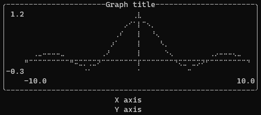
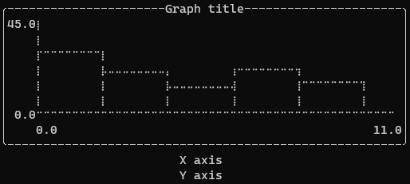

# termplot
An _extensible_ plotting library for CLI applications.


 - [Quick Start](#quick-start)
 - [Documentation](#documentation)
 - [Examples](#examples)
    + [Plotting a function](#plotting-a-function)
    + [Historigram](#historigram)
    + [Composing multiple plots](#composing-multiple-plots)

## Documentation
Find the full documentation on [doc.rs](https://docs.rs/termplot/latest/termplot)

## Quick start
To use `termplot`, add the crate to your `Cargo.toml`.
```toml
[dependencies]
termplot = "0.1.0"
```

## Examples

### Plotting a function
Here is a quick example of what plotting `sin(x) / x` looks like.

```rust
use termplot::*;

let mut plot = Plot::default();
plot.set_domain(Domain(-10.0..10.0))
    .set_codomain(Domain(-0.3..1.2))
    .set_title("Graph title")
    .set_x_label("X axis")
    .set_y_label("Y axis")
    .set_size(Size::new(50, 25))
    .add_plot(Box::new(plot::Graph::new(|x| x.sin() / x)));

println!("{plot}");
```
Output of the previous example:



### Historigram
```rust
use termplot::*;
use rand::Rng;

let mut rng = rand::thread_rng();
let values: Vec<f64> = (0..100).map(|_| rng.gen_range(0.0f64..10.0f64)).collect();

let mut plot = Plot::default();

plot.set_domain(Domain(0.0..11.0))
    .set_codomain(Domain(0.0..45.0))
    .set_title("Graph title")
    .set_x_label("X axis")
    .set_y_label("Y axis")
    .set_size(Size::new(50, 25))
    .add_plot(Box::new(plot::Historigram::new(
        values,
        vec![0.0..2.0, 2.0..4.0, 4.0..6.0, 6.0..8.0, 8.0..10.0],
    )));

println!("{plot}");
```
Output of the previous example:



### Composing multiple plots
It is also possible to compose multiple plots:

```rust
use termplot::*;
use rand::Rng;

let mut rng = rand::thread_rng();
let values: Vec<f64> = (0..100).map(|_| rng.gen_range(0.0f64..10.0f64)).collect();

let mut plot = Plot::default();

plot.set_domain(Domain(0.0..11.0))
    .set_codomain(Domain(0.0..45.0))
    .set_title("Graph title")
    .set_x_label("X axis")
    .set_y_label("Y axis")
    .set_size(Size::new(50, 25))
    .add_plot(Box::new(plot::Historigram::new(
        values,
        vec![0.0..2.0, 2.0..4.0, 4.0..6.0, 6.0..8.0, 8.0..10.0],
    )))
    .add_plot(Box::new(plot::Graph::new(|x| {
        -2.0 * (x - 5.0).powf(2.0) + 40.0
    })));

println!("{plot}");
```

Output of the previous example:


## License
MIT - Enjoy!
